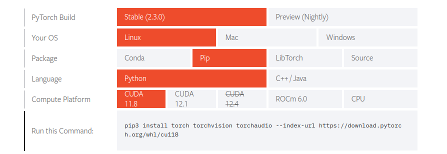

# Understanding deep learning requires rethinking generalization

## Deliverables

- **Video Link:** [Video](https://youtu.be/NTUpjh0wIx4) 
- **Report link:** [Report](https://drive.google.com/file/d/1iWHV-jIxqgBQ7_SuAxRStr7fw1b2tJee/view?usp=sharing) 
- **Code**:
    - Input_Corruption_Inception.ipynb
    - Label_Corruption_Inception.ipynb
    - results_inception.ipynb 
## How to run a notebook
I recommend use VSCode with the [Jupyter extension](https://marketplace.visualstudio.com/items?itemName=ms-toolsai.jupyter) to run the notebook.

If you are in a local environment, you can run the notebook with the following steps:

1. Create an virtual environment, I recommend using [virtualenv ](https://pypi.org/project/virtualenv/) or the python built-in [venv](https://docs.python.org/es/3/library/venv.html) module.

```bash
virtualenv .venv
```
2. Activate the virtual environment
For linux and macos:
```bash
source .venv/bin/activate
```
For windows:
```bash
.venv\Scripts\activate
```
3. Install the dependencies
```bash
pip install -r requirements.txt
```
If you have problems with the pytorch installation, you can check the [official page](https://pytorch.org/get-started/locally/) selecting your OS, package manager and CUDA version, CUDA is optional, if you don't have a GPU you can select CPU.

Remember that if you selecet CUDA, you need to have the [NVIDIA drivers](https://www.nvidia.com/Download/index.aspx) and [CUDA](https://developer.nvidia.com/cuda-downloads) installed.

